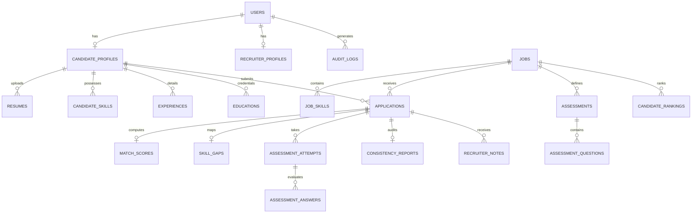

# RecruitIQ Database Schema & Relationships

RecruitIQ employs a normalized relational database design compatible with PostgreSQL and SQLite via SQLAlchemy 2.0.

## Primary Tables
1. **users**: Authentication credentials, roles (`RECRUITER`, `CANDIDATE`, `ADMIN`), active status.
2. **candidate_profiles**: Contact info, summary, education level, experience years, controlled demographic proxies.
3. **recruiter_profiles**: Organization, department, title.
4. **jobs**: Requisitions, experience required, education criteria, salary ranges, status.
5. **job_skills**: Required and preferred skills with importance weights (`High`, `Medium`, `Low`).
6. **resumes**: Uploaded file metadata, raw extracted text, parsed JSON, Parsing Confidence score.
7. **applications**: Job applications tracking status across the 5-stage timeline.
8. **assessments & assessment_questions**: Configurable adaptive test banks and item response parameters.
9. **assessment_attempts & assessment_answers**: Dynamic difficulty reached, percentage score, topic-wise mastery.
10. **match_scores**: Semantic breakdown across Skill, Experience, Education, and Projects.
11. **skill_gaps**: Strong, Moderate, and Missing competency arrays.
12. **consistency_reports**: Claimed vs verified empirical performance using neutral evidence observations.
13. **candidate_rankings**: Weighted composite ranking with recruiter-tuned factor weights.
14. **fairness_audits**: Selection rate differences, demographic parity, and equal opportunity disparity logs.
15. **counterfactual_audits**: Invariance audit logs recording demographic swap tests.
16. **development_plans**: 3-priority learning roadmaps for candidates.
17. **recruiter_notes & audit_logs**: Human supervision notes and immutable security event logs.
